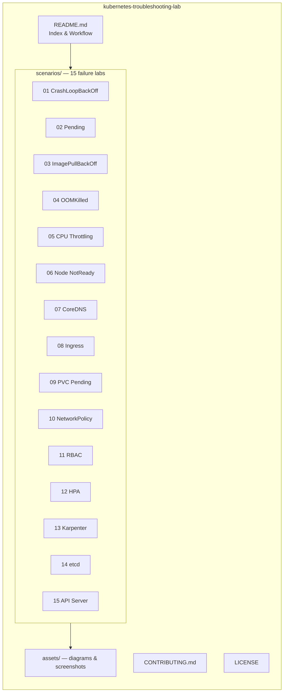
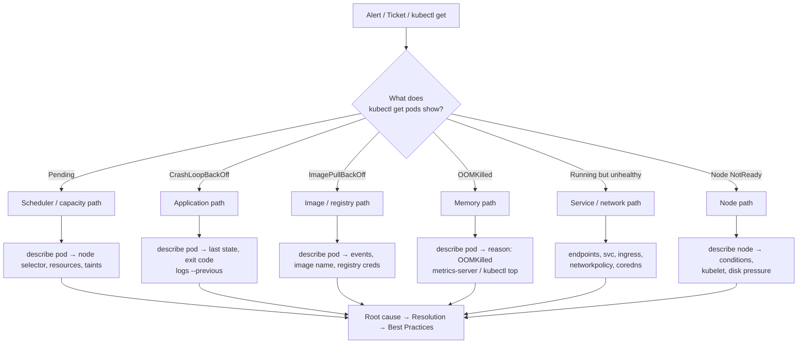

# Kubernetes Troubleshooting Lab

[](LICENSE)
[](https://kubernetes.io/)
[](https://minikube.sigs.k8s.io/)
[](https://kind.sigs.k8s.io/)
[](https://aws.amazon.com/eks/)
[](CONTRIBUTING.md)
[](https://github.com/Saif-hadd/Kubernetes-Troubleshooting-Lab)

> A production-oriented, hands-on knowledge base that demonstrates the real
> Kubernetes troubleshooting skills expected from a Mid/Senior DevOps or
> Platform Engineer. Every scenario is backed by runnable manifests, an SRE
> root-cause analysis, and the exact `kubectl` commands an on-call engineer
> would run.

---

## Table of Contents

- [Overview](#overview)
- [Repository Architecture](#repository-architecture)
- [Learning Objectives](#learning-objectives)
- [Kubernetes Troubleshooting Workflow](#kubernetes-troubleshooting-workflow)
- [Scenarios](#scenarios)
- [Common kubectl Commands](#common-kubectl-commands)
- [Debugging Cheatsheet](#debugging-cheatsheet)
- [Screenshots](#screenshots)
- [Future Scenarios Roadmap](#future-scenarios-roadmap)
- [Contributing](#contributing)
- [License](#license)

---

## Overview

Kubernetes is a complex distributed system. When something breaks in
production, engineers are expected to move fast, reason about failure domains,
and apply fixes that do not introduce regressions. This repository is a curated
set of **real-world failure scenarios** — each one runnable on Minikube, Kind,
or Amazon EKS — that map directly to incidents seen in production fleets.

Each scenario follows a consistent SRE template:

1. **Overview** — what the failure is and why it matters.
2. **Symptoms** — the exact signals an operator observes (`kubectl get`,
   `describe`, `logs`).
3. **Root Cause** — the precise reason the failure happens.
4. **Diagnosis** — a step-by-step triage path using real `kubectl` commands.
5. **Resolution** — multiple candidate fixes with tradeoffs.
6. **Best Practices** — how to prevent recurrence in production.
7. **Production Tips** — hard-won recommendations from experienced Platform
   Engineers.

The goal is not to memorize commands, but to build a repeatable **diagnostic
mental model** that scales from a single misconfigured Pod to a control-plane
outage.

---

## Repository Architecture



### Diagnostic domain map

```mermaid
flowchart LR
    subgraph Workload["Workload plane"]
        W1[CrashLoopBackOff]
        W2[ImagePullBackOff]
        W3[OOMKilled]
        W4[CPU Throttling]
        W5[HPA]
    end
    subgraph Sched["Scheduling & capacity plane"]
        C1[Pending]
        C2[Node NotReady]
        C3[Karpenter]
    end
    subgraph Net["Network & service plane"]
        N1[CoreDNS]
        N2[Ingress]
        N3[NetworkPolicy]
    end
    subgraph Storage["Storage plane"]
        ST1[PVC Pending]
    end
    subgraph Control["Control plane"]
        CP1[RBAC]
        CP2[etcd]
        CP3[API Server]
    end

    Workload -.-> Sched
    Sched -.-> Net
    Net -.-> Storage
    Storage -.-> Control
```



### Scenario layout (per directory)

```
scenarios/NN-name/
├── README.md           # SRE write-up: overview → resolution → best practices
├── deployment.yaml     # Reproduces the failure
├── service.yaml        # If the scenario is service-scoped
└── *.yaml              # Additional manifests (HPA, PDB, NetworkPolicy, RBAC…)
```

---

## Learning Objectives

By the end of this lab you will be able to:

- Triage a failing Kubernetes workload in under 5 minutes using only `kubectl`.
- Distinguish **application-level** failures (CrashLoopBackOff, OOMKilled)
  from **infrastructure-level** failures (Node NotReady, PVC Pending).
- Read Pod **events**, **conditions**, and **container statuses** to pinpoint
  root cause rather than guessing.
- Debug the **service layer** (Endpoints, CoreDNS, Ingress, NetworkPolicy)
  when Pods are healthy but traffic is not flowing.
- Diagnose **control-plane** pressure (etcd, kube-apiserver, RBAC) that
  silently degrades an entire cluster.
- Apply production **resource requests/limits, PDBs, probes, and autoscaling**
  to prevent the most common production incidents.
- Reason about **failure domains** and blast radius before applying a fix.

---

## Kubernetes Troubleshooting Workflow

A single, repeatable workflow keeps triage fast and avoids "shotgun debugging."



### The five-question triage

1. **What** is failing? (Pod, Node, Service, PVC, control plane)
2. **Where** is it failing? (Which namespace, node, container)
3. **Why** is it failing? (Events, logs, conditions, metrics)
4. **Since when**? (Events timeline, rollout history)
5. **What is the blast radius**? (Single Pod, ReplicaSet, Node, cluster)

---

## Scenarios

| # | Scenario | Domain | Failure plane |
|---|----------|--------|---------------|
| 01 | [CrashLoopBackOff](scenarios/01-crashloopbackoff/) | Workload | Application crash |
| 02 | [Pending](scenarios/02-pending/) | Scheduling | Unschedulable Pod |
| 03 | [ImagePullBackOff](scenarios/03-imagepullbackoff/) | Workload | Registry / image |
| 04 | [OOMKilled](scenarios/04-oomkilled/) | Workload | Memory limit |
| 05 | [CPU Throttling](scenarios/05-cpu-throttling/) | Workload | CPU limit / latency |
| 06 | [Node NotReady](scenarios/06-node-notready/) | Node | Kubelet / pressure |
| 07 | [CoreDNS](scenarios/07-coredns/) | Network | Cluster DNS |
| 08 | [Ingress](scenarios/08-ingress/) | Network | Ingress routing |
| 09 | [PVC Pending](scenarios/09-pvc-pending/) | Storage | StorageClass / binding |
| 10 | [NetworkPolicy](scenarios/10-networkpolicy/) | Network | Traffic isolation |
| 11 | [RBAC](scenarios/11-rbac/) | Control plane | Permissions |
| 12 | [HPA](scenarios/12-hpa/) | Autoscaling | Metrics / scaling |
| 13 | [Karpenter](scenarios/13-karpenter/) | Autoscaling | Node provisioning |
| 14 | [etcd](scenarios/14-etcd/) | Control plane | Quorum / latency |
| 15 | [API Server](scenarios/15-api-server/) | Control plane | API availability |

---

## Common kubectl Commands

A focused subset — the 20% of commands that resolve 80% of incidents.

### Workload inspection

```bash
kubectl get pods -n <ns> -o wide
kubectl get pods -n <ns> --field-selector=status.phase!=Running
kubectl describe pod <pod> -n <ns>
kubectl logs <pod> -n <ns> --previous
kubectl logs <pod> -n <ns> -c <container> --tail=100 -f
kubectl exec -it <pod> -n <ns> -- /bin/sh
kubectl get events -n <ns> --sort-by=.lastTimestamp
kubectl get deploy,rs,po -n <ns> -l app=<name>
```

### Node & cluster health

```bash
kubectl get nodes -o wide
kubectl describe node <node>
kubectl get cs            # scheduler, controller-manager, etcd (legacy)
kubectl get --raw='/readyz?verbose'
kubectl top nodes
kubectl top pods -n <ns> --sort-by=memory
```

### Networking & services

```bash
kubectl get svc -n <ns> -o wide
kubectl get endpoints -n <ns>
kubectl get endpointslice -n <ns>
kubectl get ingress -n <ns>
kubectl get networkpolicy -n <ns>
kubectl get pods -n kube-system -l k8s-app=kube-dns
kubectl get svc -n kube-system kube-dns
```

### Storage

```bash
kubectl get pvc,pv,sc
kubectl describe pvc <name> -n <ns>
kubectl get storageclass
```

### RBAC & autoscaling

```bash
kubectl auth can-i --list --as=<user>
kubectl auth can-i <verb> <resource> --as=<user> -n <ns>
kubectl get roles,rolebindings,clusterroles,clusterrolebindings -n <ns> -o wide
kubectl get hpa -n <ns>
kubectl describe hpa <name> -n <ns>
```

### Live debugging

```bash
kubectl debug -it <pod> --image=busybox --target=<container>
kubectl debug node/<node> -it --image=busybox
kubectl port-forward svc/<svc> 8080:80 -n <ns>
kubectl run tmp --image=nicolaka/netshoot --rm -it --restart=Never -- /bin/sh
```

---

## Debugging Cheatsheet

### Pod state → first command to run

| Pod status | First command | What to look for |
|------------|---------------|------------------|
| `Pending` | `kubectl describe pod` | Events: `FailedScheduling`, node selector, taints, resources |
| `CrashLoopBackOff` | `kubectl logs --previous` | App stack trace, exit code in `lastState` |
| `ImagePullBackOff` | `kubectl describe pod` | Events: `Failed to pull image`, registry, image tag |
| `OOMKilled` | `kubectl describe pod` | `lastState.terminated.reason: OOMKilled`, memory limit |
| `ErrImagePull` | `kubectl describe pod` | Image name, `imagePullSecrets`, registry endpoint |
| `Completed` (unexpected) | `kubectl logs` | Command exit, missing `--` in args |
| `Running` but 503 | `kubectl get endpoints` | Endpoints empty → selector/health check mismatch |
| `Running` but DNS fails | `kubectl exec … nslookup` | CoreDNS pods, `kube-dns` service, `ndots` |
| Node `NotReady` | `kubectl describe node` | Conditions: `DiskPressure`, `MemoryPressure`, `PIDPressure` |

### Quick triage one-liners

```bash
# All non-running pods across the cluster
kubectl get pods -A --field-selector=status.phase!=Running,status.phase!=Succeeded

# Pods restarting in the last hour
kubectl get pods -A -o jsonpath='{range .items[*]}{.metadata.name}{"\t"}{.status.containerStatuses[0].restartCount}{"\n"}{end}' | awk '$2>0'

# Events sorted by time across a namespace
kubectl get events -n <ns> --sort-by=.lastTimestamp

# Node conditions at a glance
kubectl get nodes -o jsonpath='{range .items[*]}{.metadata.name}{"\t"}{.status.conditions[-1].type}{"="}{.status.conditions[-1].status}{"\n"}{end}'

# Memory hogs
kubectl top pods -A --sort-by=memory | head -20

# Who can create pods in a namespace (RBAC audit)
kubectl auth can-i create pods --as=<user> -n <ns>
```

### Signals vs. noise

| Signal | Reliable? | Notes |
|--------|-----------|-------|
| `kubectl get pods` STATUS | High | But `Running` ≠ healthy — check readiness |
| `kubectl describe` Events | High | Cleared after ~1 hour; capture early |
| `kubectl logs --previous` | High | Only if container crashed |
| `kubectl top` | Medium | Requires metrics-server; point-in-time |
| Readiness probe failures | High | Check `describe` events, not just logs |
| Restart count | High | Trending up = chronic, not transient |

---

## Screenshots

Screenshots of each scenario reproduced on a real cluster live in
`assets/screenshots/`.

| Scenario | Screenshot |
|----------|------------|
| 01 CrashLoopBackOff | `assets/screenshots/01-crashloopbackoff.png` |
| 02 Pending | `assets/screenshots/02-pending.png` |
| 03 ImagePullBackOff | `assets/screenshots/03-imagepullbackoff.png` |
| 04 OOMKilled | `assets/screenshots/04-oomkilled.png` |
| 05 CPU Throttling | `assets/screenshots/05-cpu-throttling.png` |
| 06 Node NotReady | `assets/screenshots/06-node-notready.png` |
| 07 CoreDNS | `assets/screenshots/07-coredns.png` |
| 08 Ingress | `assets/screenshots/08-ingress.png` |
| 09 PVC Pending | `assets/screenshots/09-pvc-pending.png` |
| 10 NetworkPolicy | `assets/screenshots/10-networkpolicy.png` |
| 11 RBAC | `assets/screenshots/11-rbac.png` |
| 12 HPA | `assets/screenshots/12-hpa.png` |
| 13 Karpenter | `assets/screenshots/13-karpenter.png` |
| 14 etcd | `assets/screenshots/14-etcd.png` |
| 15 API Server | `assets/screenshots/15-api-server.png` |

> Placeholders — capture your own by running each scenario and screenshotting
> the `kubectl` output. Keeping real output in the repo keeps the examples
> credible for reviewers and recruiters.

---

## Future Scenarios Roadmap

Planned additions, prioritized by how often they appear in production incidents:

- [ ] **16 - InitContainer failure** — `Init:CrashLoopBackOff` vs main container
- [ ] **17 - Service mesh (Istio) misconfiguration** — sidecar injection, mTLS
- [ ] **18 - Certificate / TLS expiry** — expired serving certs, kubelet client certs
- [ ] **19 - kube-proxy conntrack exhaustion** — `nf_conntrack: table full`
- [ ] **20 - Cluster autoscaler stuck** — `cluster-autoscaler` status, max node limit
- [ ] **21 - Volume detach/attach stuck** — stuck volumes after node drain
- [ ] **22 - PodSecurity admission violation** — `Restricted` policy, privileged pods
- [ ] **23 - Leader election churn** — controller-manager / scheduler flapping
- [ ] **24 - DNS ndots / search domain storms** — external name resolution latency
- [ ] **25 - Metrics server scrape failure** — HPA showing `<unknown>` targets
- [ ] **26 - CNI plugin failure** — Calico/Cilium dataplane, missing routes
- [ ] **27 - kubelet PLEG issues** — `PLEG is not healthy` events
- [ ] **28 - CronJob concurrency / missed schedules** — `successfulJobsHistoryLimit`

---

## Contributing

Contributions are welcome — see [CONTRIBUTING.md](CONTRIBUTING.md) for
guidelines on adding scenarios, improving manifests, and raising the quality bar.

---

## License

This project is licensed under the [MIT License](LICENSE).
